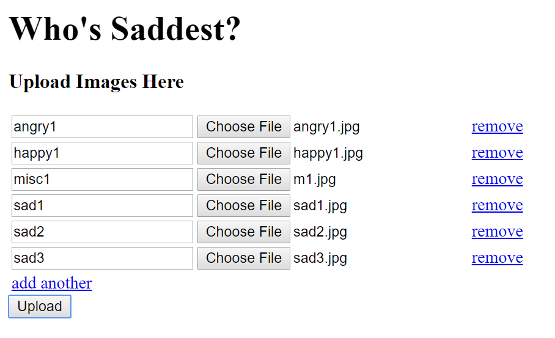

# Who's Saddest

A web application that captures human face components in photos, detect the 
emotions on the faces and rank the people based on their sadness.

*A WelcomeBackHack2019 Project with Think\[Box\] in Case Western Reserve 
University*

## Getting Started

```bash
# Clone the project into a folder
# cd project-folder
# install required
pip install -r requirements.txt
# Django migrations
python manage.py makemigrations
python manage.py migrate
# Run server
python mnaage.py runserver
```

After running the above steps, visit `localhost:8000` to test the application. 

### Test the program

Test images could be found under `test_images/`. All images are obtained from the Internet and the owner of this repository does not have the copyright over these images. 

## Method

### Face Detection

Histogram of Oriented Gradients sliding window facial detection.

### Emotion Detection 

Pre-trained emotion recognition model.

```
_________________________________________________________________
Layer (type)                 Output Shape              Param #   
=================================================================
conv2d_1 (Conv2D)            (None, 46, 46, 32)        320       
_________________________________________________________________
conv2d_2 (Conv2D)            (None, 44, 44, 64)        18496     
_________________________________________________________________
max_pooling2d_1 (MaxPooling2 (None, 22, 22, 64)        0         
_________________________________________________________________
conv2d_3 (Conv2D)            (None, 20, 20, 128)       73856     
_________________________________________________________________
max_pooling2d_2 (MaxPooling2 (None, 10, 10, 128)       0         
_________________________________________________________________
conv2d_4 (Conv2D)            (None, 8, 8, 128)         147584    
_________________________________________________________________
max_pooling2d_3 (MaxPooling2 (None, 4, 4, 128)         0         
_________________________________________________________________
conv2d_5 (Conv2D)            (None, 4, 4, 7)           903       
_________________________________________________________________
conv2d_6 (Conv2D)            (None, 1, 1, 7)           791       
_________________________________________________________________
flatten_1 (Flatten)          (None, 7)                 0         
_________________________________________________________________
activation_1 (Activation)    (None, 7)                 0         
=================================================================
Total params: 241,950
Trainable params: 241,950
Non-trainable params: 0
_________________________________________________________________
```

### Tools Used
- `Django` for the web-backend
- `dlib` for face detection
- `Keras` and `Tensorflow` for emotion detection


## Screenshots  

- Index page


- Upload images



- Sadness Ranking


